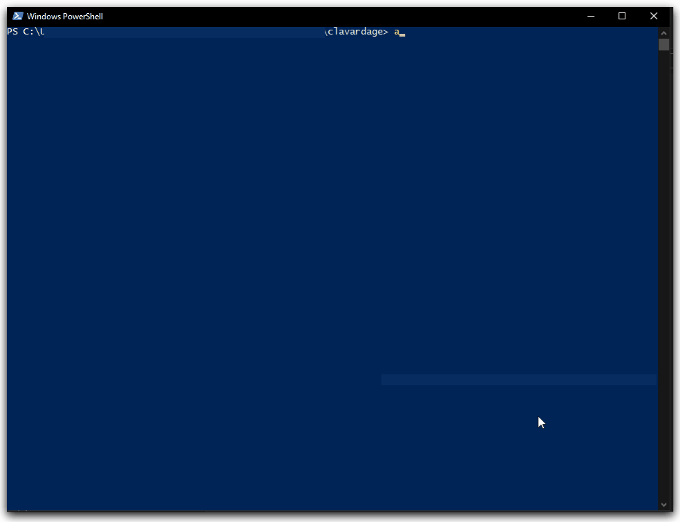

# SuperClavardeur™ 
SuperClavardeur™ est une messagerie instantanée par pseudonyme destinée à accroître l'efficacité d'une équipe en permettant l'envoi simplifié de messages et de fichiers. 
SuperClavardeur™ permet une utilisation en réseau local sans intermédiaires.
L'application permet également une utilisation via internet mais requiert la mise en place d'un serveur de présence. 
L'envoi et la réception des messages via internet se fait en Peer-to-Peer. Le support de la configuration automatique du NAT gère seulement les équipements 
compatibles upnp.

## Fonctionnalités principales
- Choix et gestion d'un pseudo unique
- Découverte d'utilisateurs sur un réseau local
- Découverte d'utilisateurs depuis l'extérieur
- Envoi/réception de messages entre utilisateurs
- Envoi/réception de fichiers entre utilisateurs
- Gestion de l'historique (avec recherche et affichage) des anciens messages
- Gestion de groupes de discussion

## Sommaire
- [Installation](installation.md)
- [Manuel d'utilisation](manuel.md)
- [Technologie](techno.md)
- [Choix d'implémentation](choix.md)
- [Batterie de tests](tests.md)

**Avertissements :** Ce projet a été mené à titre d'exercice. Il contient en l'état de multiple failles de sécurité. 
SuperClavardeur n'est pas une marque déposée. 
