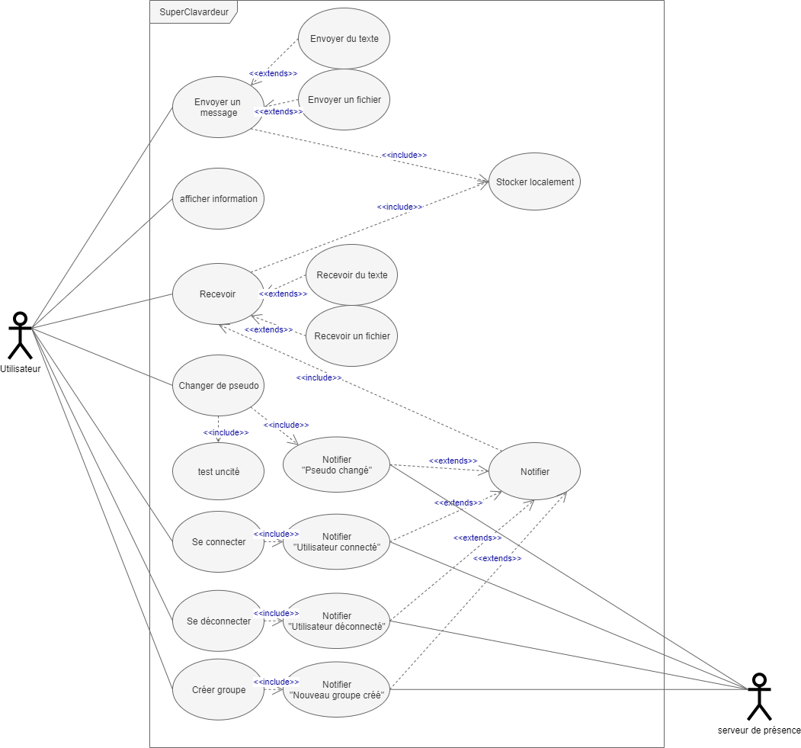

## Choix d'implémentation

### Choix de conception
#### MVC

NB: cette représentation de ces trois packages Model-View-Controller est une vue de l'esprit qui a été respectée dans son principe — qui a facilité le développement simultané de l'application et éventuellement facilitera la maintenabilité et l'amélioration de l'application — mais qui n'a volontairement pas été écrite pour ne pas surcharger le code.

##### Modèle
Le modèle contient le plus de classes (12 en tout).
Plus de la moitié d'entre-elles sont consacrées au réseau.
Dans les faits les classes `Group`, `Interlocuteur`, `Message` et `Personne` ont été réunies dans un même package com.clava.serializable pour que Message puisse être correctement dé/sérialisée par le serveur HTTP.
`Reseau` et `BD` sont des singletons.

##### Vue
3 vues seulement qui correspondent à 
- Une `VuePrincipale` qui :
	- est directement contrôlée par le `ControllerApplication`
	- permet la visualisation des messages, des utilisateurs de l'application
	- coordonne :
		- Une `VueChoixPseudo` 
		- Une `VueCreationGroupe`

##### Contrôleur
Le contrôleur se résume en une seule classe `ControllerApplication`.
Le couplage entre `ControleurApplication` et les classes serveurs du réseau `ServeurUDP` et `ServeurSocketTCP` est affaiblit grâce au design patern Observer.

### Types des messages
L'un des éléments essentiel du fonctionnement de l'application peut se résumé en un attribut de la classe `Message` : `Message.Type`. 
```
public enum Type {CONNECTION, DECONNECTION, ASKPSEUDO, REPLYPSEUDO, SWITCH, WHOISALIVE, ALIVE, FILE, DEFAULT, GROUPCREATION, OKSERVEUR}
```
Chaque type de message est traité spécifiquement par `ControleurApplication` et peuvent être interprétés de la manière suivante :
- `CONNECTION` "L'émetteur du message vient juste de me connecter"
- `DECONNEXION` "L'émetteur du message vient juste de me déconnecter"
- `ASKPSEUDO` "L'émetteur du message demande de changer de pseudo"
- `REPLYPSEUDO` "L'émetteur du message possède déjà le pseudo demandé par le destinataire"          
- `SWITCH` "L'émetteur du message vient juste de changer de pseudo" 
- `WHOISALIVE` "L'émetteur du message demande qui est présent"
- `ALIVE` "L'émetteur du message est présent" ou "réception d'une liste de personnes connectées en provenance du serveur"
- `FILE` "L'émetteur du message envoie un fichier à télécharger" 
- `DEFAULT` "L'émetteur du message envoie un message textuel"
- `GROUPCREATION` "L'émetteur du message crée un groupe dont les membres sont les destinataires" 
- `OKSERVEUR` "Le serveur répond à une requête HTTP"

Le choix d'avoir factorisé toutes ces fonctionnalités en un seul attribut nous a permis d'avoir un code extensible à volonté et très peu redondant dans la partie réseau. 
Ainsi l'ajout des fonctionnalités *serveur de présence* ou *groupe* se sont faites en ajoutant simplement les types GROUPCREATION, OKSERVEUR au Type des messages et en écrivant le comportement idoine à adopter à leur réception dans ControleurApplication et nous avons très peu de changement dans les classes réseaux (seulement rajouter la classe `ClientHTTP` pour envoyer des requêtes pour le *serveur de présence*).

### Fonctionnement des principaux cas d'utilisation
#### Diagramme de cas d'utilisation
<br>

#### Vues
*Vue choix pseudo :*<br>
<br>
*Vue principale :*<br>
<br>

#### Se connecter
voir le [diagramme de séquence](conception/seqdiagram_seconnecter.png)
1. Installer et lancer SuperClavardeur™
	- le programme demande qui est présent `Message.Type =`**`WHOISALIVE`**
	- *Vue choix Pseudo* s'ouvre
2. Rentrer son pseudo 
	- si pseudo vide
		- `Ton pseudo ne peut pas être vide :'( Dommage... 🙈"`
		- ↳ retour 2.
	- sinon
        - le programme stocke le pseudo demandé pour répondre `Message.Type =`**`REPLYPSEUDO`** s'il reçoit `Message.Type =`**`ASKPSEUDO`**
		- le programme demande si ce pseudo est déjà pris `Message.Type =`**`ASKPSEUDO`** (local et serveur)
		- si le programme reçoit que le pseudo déjà pris dans les 2s `Message.Type =`**`REPLYPSEUDO`**
			- `Ton pseudo est déjà pris désolé :'( Dommage... 🙈`
            - suppression du stockage du pseudo 
			- ↳ retour 2.
		- sinon
			- le programme notifie la connexion de l'utilisateur aux autres utilisateurs `Message.Type =`**`CONNECTION`** et au serveur
			- *Vue choix Pseudo* se ferme
			- *Vue principale* s'ouvre

#### Changer de pseudo
voir le [diagramme de séquence](conception/seqdiagram_changerpseudo.png)
1. Lancer SuperClavardeur™ et se connecter
2. Cliquer sur `bouton changement pseudo` de la *Vue principale*
	- *Vue choix Pseudo* s'ouvre
3. Rentrer son nouveau pseudo 
	- si pseudo vide
		- `Ton pseudo ne peut pas être vide :'( Dommage... 🙈"`
		- ↳ retour 3.
	- sinon
        -le programme stocke le pseudo demandé pour répondre `Message.Type =`**`REPLYPSEUDO`** s'il reçoit `Message.Type =`**`ASKPSEUDO`**
		- le programme demande si ce pseudo est déjà pris `Message.Type =`**`ASKPSEUDO`** (local et serveur)
		- si le programme reçoit que le pseudo déjà pris dans les 2s `Message.Type =`**`REPLYPSEUDO`**
			- `Ton pseudo est déjà pris désolé :'( Dommage... 🙈`
            - suppression du stockage du pseudo 
			- ↳ retour 3.
		- sinon
			- le programme notifie le changement de pseudo aux autres utilisateurs `Message.Type =`**`SWITCH`** et au serveur 
			- *Vue choix Pseudo* se ferme
			- le programme met à jour sa base de donnée locale
			- le programme met à jour le nom de pseudo partout dans la *Vue principale*

#### Créer un nouveau groupe 
1. Lancer SuperClavardeur™ et se connecter
2. Cliquer sur `bouton création groupe` de la *Vue principale*
    - S'il y a moins de deux autres utilisateurs connectés:
        - message "il n'y a pas assez d'utilisateurs connectés"
        - *Vue Création Groupe* se ferme
    - Sinon 
        - *Vue Création Groupe* s'ouvre
3. Sélectionner des utilisateurs 
    - si le groupe est déjà créé:
        - message "le groupe existe déjà" 
        - ↳ retour 2. 
    - sinon 
        - le programme notifie de la création de groupe aux autres utilisateurs `Message.Type =`**`GROUPCREATION`**
        - le programme ajoute le nouveau groupe dans la *Vue principale*
        - *Vue Création Groupe* se ferme

#### Envoyer un message texte
voir le [diagramme de séquence](conception/seqdiagram_envoyertext.png)
1. Lancer SuperClavardeur™ et se connecter
2. Sélectionner un destinataire dans la `zone de découverte` de la *Vue principale*
3. Rentrer un texte à envoyer dans la `zone de texte` 
4. Cliquer sur le `bouton envoi` ou `SHIFT` + `↵enter`
	- si destinataire n'est pas connecté
		- `Vous ne pouvez pas envoyer un message à un utilisateur non connecté :p"`
		- ↳ retour 2.
	- si message vide
		- `Vous ne pouvez pas envoyer un message vide désolé :p"`
		- ↳ retour 3.
	- sinon
		- le texte est encapsulé dans un message daté et envoyé au destinataire par TCP `Message.Type =`**`DEFAULT`**
		- le message est enregistré dans la base de donnée locale
		- la conversation avec ce destinataire (`visualisation historique` de la *Vue principale*) est mise à jour 

#### Envoyer un message fichier
voir le [diagramme de séquence](conception/seqdiagram_envoyerfichier.png)
1. Lancer SuperClavardeur™ et se connecter
2. Sélectionner un destinataire dans la `zone de découverte` de la *Vue principale*
3. Cliquer sur le `bouton envoi fichier` ou `SHIFT` + `F`
	- si destinataire non connecté
		- `Vous ne pouvez pas envoyer un message à un utilisateur non connecté :p"`
		- ↳ retour 2.
	- sinon
		- le fichier est encapsulé dans un message daté et envoyé au destinataire par TCP `Message.Type =`**`FILE`**
		- le message est enregistré dans la base de donnée locale
		- la conversation avec ce destinanataire (`visualisation historique` de la *Vue principale*) est mise à jour

#### Recevoir un message texte/fichier
voir le [diagramme de séquence](conception/seqdiagram_recevoirmessage.png)
1. Lancer SuperClavardeur™ et se connecter
2. Recevoir un message/fichier 
	- les données du message sont desencapsulés du message `Message.Type =`**`DEFAULT`**/`Message.Type =`**`FILE`**
	- le message est enregistré dans la base de donnée locale
	- la conversation avec ce destinanataire (`visualisation historique` de la *Vue principale*) est mise à jour 

#### Se déconnecter
voir le [diagramme de séquence](conception/seqdiagram_sedeconnecter.png)
1. Lancer SuperClavardeur™ et se connecter
2. Fermer l'application `bouton déconnexion` ou `x` de la *Vue principale*
	- le programme notifie la déconnexion de l'utilisateur aux autres utilisateurs `Message.Type =`**`DECONNECTION`** et au serveur
	- le programme ferme les sockets UDP et TCP
	- le programme ferme la connexion à la base de donnée
	- *Vue principale* se ferme

<br><br><br>
[< Technologie](techno.md)•[Batterie de tests >](tests.md)<br>
retour au [sommaire](README.md)<br>
