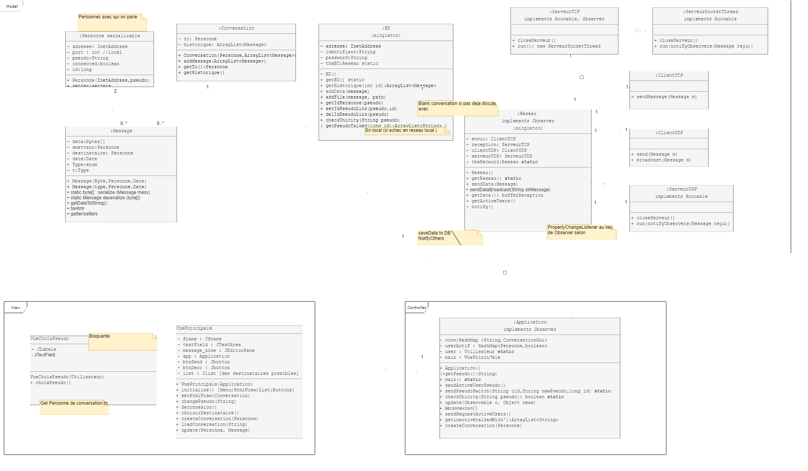

## Choix d'implémentation

### Choix de conception
#### MVC

NB: cette représentation de ces trois packages Model-View-Controller est une vue de l'esprit qui n'a pas été implémentée.

##### Modèle
Le modèle contient le plus de classes (12 en tout).
Plus de la moitié d'entre-elles sont consacrées au réseau.
Dans les faits les classes `Group`, `Interlocuteur`, `Message` et `Personne` ont été réunies dans un même package com.clava.serializable pour que Message puisse être correctement dé/sérialisée par le serveur HTTP.
`Reseau` et `BD` sont des singletons.

##### Vue
3 vues seulement qui correspondent à 
- Une `VuePrincipale` qui :
	- est directement contrôlée par le `ControllerApplication`
	- permet la visualisation des messages, des utilisateurs de l'application
	- coordonne :
		- Une `VueChoixPseudo` 
		- Une `VueCreationGroupe`

##### Contrôleur
Le contrôleur se résume en une seule classe `ControllerApplication`.
Le couplage entre `ControllerApplication` et les classes serveurs du réseau `ServeurUDP` et `ServeurSocketTCP` est affaiblit grâce au design patern Observer.

### Fonctionnement des principales actions
#### Vues
*Vue choix pseudo :* 
 
*Vue principale :* 
 

#### Connexion
1. Installer et lancer SuperClavardeur™
	- le programme demande qui est présent `Message.Type =`**`WHOISALIVE`**
	- *Vue choix Pseudo* s'ouvre
2. Rentrer son pseudo 
	- si pseudo vide
		- `Ton pseudo ne peut pas être vide :'( Dommage... 🙈"`
		- ↳ retour 2.
	- sinon
		- le programme demande si ce pseudo est déjà pris `Message.Type =`**`ASKPSEUDO`**
		- si le programme reçoit que le pseudo déjà pris dans les 2s `Message.Type =`**`REPLYPSEUDO`**
			- `Ton pseudo est déjà pris désolé :'( Dommage... 🙈`
			- ↳ retour 2.
		- sinon
			- le programme notifie la connexion de l'utilisateur aux autres utilisateurs `Message.Type =`**`CONNECTION`**  
			- *Vue principale* s'ouvre
			- *Vue choix Pseudo* se ferme

#### Changement de pseudo
1. Lancer SuperClavardeur™ et se connecter
2. Cliquer sur `bouton changement pseudo` de la *Vue principale*
	- *Vue choix Pseudo* s'ouvre
3. Rentrer son nouveau pseudo 
	- si pseudo vide
		- `Ton pseudo ne peut pas être vide :'( Dommage... 🙈"`
		- ↳ retour 3.
	- sinon
		- le programme demande si ce pseudo est déjà pris `Message.Type =`**`ASKPSEUDO`**
		- si le programme reçoit que le pseudo déjà pris dans les 2s `Message.Type =`**`REPLYPSEUDO`**
			- `Ton pseudo est déjà pris désolé :'( Dommage... 🙈`
			- ↳ retour 3.
		- sinon
			- le programme notifie le changement de pseudo aux autres utilisateurs `Message.Type =`**`SWITCH`**  
			- le programme met à jour le nom de pseudo partout dans la *Vue principale*
			- *Vue choix Pseudo* se ferme

#### Création d'un groupe 
1. Lancer SuperClavardeur™ et se connecter
2. Cliquer sur `bouton création groupe` de la *Vue principale*
	- *Vue Création Groupe* s'ouvre
3. Rentrer le nom du groupe
4. Sélectionner des utilisateurs 
	- le programme notifie de la création de groupe aux autres utilisateurs `Message.Type =`**`GROUPCREATION`**
	- le programme ajoute le nouveau groupe dans la *Vue principale*
	- *Vue Création Groupe* se ferme

#### Envoi d'un message texte
1. Lancer SuperClavardeur™ et se connecter
2. Sélectionner un destinataire dans la `zone de découverte` de la *Vue principale*
3. Rentrer un texte à envoyer dans la `zone de texte` 
4. Cliquer sur le `bouton envoi` ou `SHIFT` + `↵enter`
	- si destinataire non connecté
		- `Vous ne pouvez pas envoyer un message à un utilisateur non connecté :p"`
		- ↳ retour 2.
	- si message vide
		- `Vous ne pouvez pas envoyer un message vide désolé :p"`
		- ↳ retour 3.
	- sinon
		- le texte est encapsulé dans un message daté et envoyé au destinataire par TCP `Message.Type =`**`DEFAULT`**
		- le message est enregistré dans la base de donnée locale
		- la conversation avec ce destinanataire (`visualisation historique` de la *Vue principale*) est mise à jour avec la base de donnée locale

#### Envoi d'un message fichier
1. Lancer SuperClavardeur™ et se connecter
2. Sélectionner un destinataire dans la `zone de découverte` de la *Vue principale*
3. Cliquer sur le `bouton envoi fichier` ou `SHIFT` + `F`
	- si destinataire non connecté
		- `Vous ne pouvez pas envoyer un message à un utilisateur non connecté :p"`
		- ↳ retour 2.
	- sinon
		- le fichier est encapsulé dans un message daté et envoyé au destinataire par TCP `Message.Type =`**`FILE`**
		- le message est enregistré dans la base de donnée locale
		- la conversation avec ce destinanataire (`visualisation historique` de la *Vue principale*) est mise à jour avec la base de donnée locale

#### Réception d'un message texte/fichier
1. Lancer SuperClavardeur™ et se connecter
2. Recevoir un message/fichier 
	- les données du message sont desencapsulés du message `Message.Type =`**`DEFAULT`**/`Message.Type =`**`FILE`**
	- le message est enregistré dans la base de donnée locale
	- la conversation avec ce destinanataire (`visualisation historique` de la *Vue principale*) est mise à jour avec la base de donnée locale

#### Déconnexion
1. Lancer SuperClavardeur™ et se connecter
2. Fermer l'application `bouton déconnexion` ou `x` de la *Vue principale*
	- le programme notifie la déconnexion de l'utilisateur aux autres utilisateurs `Message.Type =`**`DECONNECTION`** 
	- le programme ferme les sockets UDP et TCP
	- le programme ferme la connexion à la base de donnée
	- *Vue principale* se ferme

   
[< Manuel d'utilisation](manuel.md)•[Batterie de tests >](tests.md) 
retour au [sommaire](README.md) 