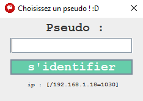
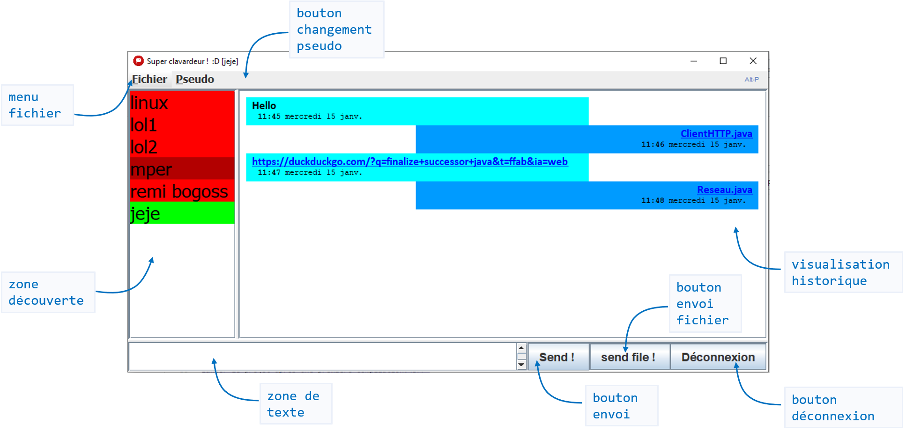

## Manuel d'utilisation
**prérequis** : Installation du terminal réussie<br>

### Aperçu
*Vue choix pseudo :*<br>
<br>
*Vue principale :*<br>
<br>

### Lancement
Lancer l'application après une première compilation:<br>
```ant relaunch```<br>

### Choisir un nouveau pseudo
Au lancement de l'application, *Vue Choix Pseudo* s'ouvre.<br>
Renseignez votre pseudo et cliquez sur `enter`.<br>
*Vue Choix Pseudo* sera ensuite accessible à n'importe quel moment par le `bouton changement pseudo` de la *Vue principale*.
#### Tests unicité du pseudo 
##### Lorsqu'un utilisateur a déjà pris le pseudo
- Installer et lancer Clavardeur™ sur deux terminaux 
- S'identifier avec un pseudo (non vide) avec un terminal
- Remplir le champs pseudo de *Vue Choix Pseudo* avec le même pseudo
→ Un message d'erreur s'affiche : `Ton pseudo est déjà pris désolé :'( Dommage... 🙈`

##### Lorsque deux utilisateurs veulent le même pseudo en même temps
- Installer et lancer Clavardeur™ sur deux terminaux 
- Rentrer un même pseudo (non vide) dans le champs pseudo de *Vue choix pseudo*
- Cliquer sur `s'identifier`, simultanément sur les deux machines
→ Un message d'erreur s'affiche : `Ton pseudo est déjà pris désolé :'( Dommage... 🙈`

### Envoyer/recevoir un message
Dans la *Vue principale*, écrire un message dans la `zone de texte`.<br>
Envoyez-le en cliquant sur le `bouton d'envoi` ou `SHIFT + ENTER`.<br> 
N'hésitez pas à écrire des liens url `https://google.com` : ils sont cliquables !
#### Tests réseau
##### Localhost
- Sélectioner son propre pseudo dans la `zone de découverte` de la *Vue principale*
- Envoyer un message
→ La reception est instantanée : vous pouvez désormais vous écrire des penses-bêtes !

##### Local
- Sélectioner un pseudo connecté (vert) sur le réseau local dans la `zone de découverte` de la *Vue principale*
- Envoyer un message 
→ Le destinataire le reçoit
→ Le message sera désormais consultable à tout moment dans la `visualisation hitorique` associé à ce pseudo destinataire !

##### Internet
- Sélectioner un pseudo connecté (vert) sur un réseau distant dans la `zone de découverte` de la *Vue principale*.
- Envoyer un message
→ Le destinataire le reçoit 
→ Le message sera désormais consultable à tout moment dans la `visualisation hitorique` associé à ce pseudo destinataire !

#### Résoudre problèmes de réseau 
##### Configurer le Pare-feu
Vérifier que Java SE a bien les autorisations du pare-feu du terminal sur les réseaux **privés** et **publiques**.

##### Configurer réseau de l'application [`config.ini`](config.ini)
Les données suivantes peuvent y être configurées manuellement :
- port TCP de l'application
- port UDP de l'application
- @IP, port du serveur de présence
- @IP locale si problème de détection auto IP 
- @MAC locale si problème de détection auto MAC (e.g. s'il n'y a pas le droit de lecture sur l'adresse)


### Envoyer/recevoir un fichier
Dans la *Vue principale*, choisir un fichier à envoyer par le `bouton envoi fichier` de la *Vue principale* ou par ou `SHIFT + F`.<br> 
Les liens des noms de fichiers sont cliquables !


### Astuces & Raccourcis
Envoyer un message texte : `SHIFT + ENTER`<br>
Sélectionner un (ou des) fichier(s) à envoyer : `SHIFT + F`<br>
Ouvrir le dossier des fichiers reçus  : `ALT + O`<br>
Changer dossier de téléchargement : `ALT + C`<br>
Changer de pseudo  : `ALT + P`<br>

NB: Les noms des fichiers reçus sont cliquables ! <br>
Et les liens écrits à la volée e.g. `https://google.com` aussi !
<br><br><br>
[< installation](installation.md "< installation")          •          [choix d'implémentation >](choix.md "choix d'implémentation >")
retour au [sommaire](README.md)<br>