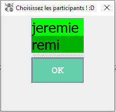

## Manuel d'utilisation
**prérequis** : Installation réussie<br>

### Aperçu
*Vue choix pseudo :*<br>
<br>
*Vue principale :*<br>
<br>
*Vue création groupe :*<br>
<br>

### Lancement
Lancer l'application après une première compilation:<br>
```ant relaunch```<br>

### Changement de pseudo
Au lancement de l'application, *Vue Choix Pseudo* s'ouvre.<br>
Renseignez votre pseudo et cliquez sur `↵enter`.<br>
*Vue Choix Pseudo* sera ensuite accessible à n'importe quel moment par le `bouton changement pseudo` de la *Vue principale*.

### Créer un groupe
Dans la *Vue principale*, `menu fichier`/`Créer un groupe` pour ouvrir la *Vue création groupe*. Puis sélectionner (`CTRL` + `clic`) au moins deux personnes "pseudo1" et "pseudo2" disponibles. Pour s'adresser à ce groupe sélectionner la nouvelle entrée dans la `zone de découverte` au nom de "□pseudo1:pseudo2"

### Envoyer/recevoir un message
Dans la *Vue principale*, écrire un message dans la `zone de texte`.<br>
Envoyez-le en cliquant sur le `bouton d'envoi` ou `SHIFT` + `↵enter`.<br> 
N'hésitez pas à écrire des liens url `https://google.com` : ils sont cliquables !

### Envoyer/recevoir un fichier
Dans la *Vue principale*, choisir un fichier à envoyer par le `bouton envoi fichier` de la *Vue principale* ou par ou `SHIFT` + `F`.<br> 
Les liens des noms de fichiers sont cliquables !

### Résoudre problèmes de connexion
#### Configurer le Pare-feu
Vérifier que Java SE a bien les autorisations du pare-feu du terminal sur les réseaux **privés** et **publiques**.

#### Configurer réseau de l'application [`config.ini`](config.ini)
Les données suivantes peuvent y être configurées manuellement :
- port TCP de l'application
- port UDP de l'application
- @IP, port du serveur de présence
- @IP locale si problème de détection auto IP 
- @MAC locale si problème de détection auto MAC (e.g. s'il n'y a pas le droit de lecture sur l'adresse)

### Astuces & Raccourcis
Envoyer un message texte : `SHIFT` + `↵enter`<br>
Sélectionner un (ou des) fichier(s) à envoyer : `SHIFT` + `F`<br>
Ouvrir le dossier des fichiers reçus  : `ALT` + `O`<br>
Changer dossier de téléchargement : `ALT` + `C`<br>
Changer de pseudo  : `ALT` + `P`<br>

<br><br><br>
[< Installation](installation.md)•[Technologie >](techno.md)<br>
retour au [sommaire](README.md)<br>
