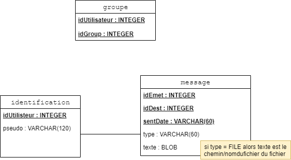

## Technologie 

### Java SE 11
Java est un langage de programmation orienté objet.
[télécharger](https://www.oracle.com/technetwork/java/javase/downloads/jdk11-downloads-5066655.html "oracle.com/downloads")

### ant
Ant (fondation Apache) est un logiciel qui automatise la compilation et la génération de la documentation de projets Java.<br>
Ant permet de gagner du temps<br>
Compiler l'ensemble du projet :
```ant```<br>
Générer la javadoc à retrouver dans doc/ : 
```ant javadoc```<br>
Ant permet également de d'archiver au format JAR ou WAR.<br>

### ini4j
ini4j est une API Java simple pour gérer les fichiers de configuration au format .ini de Windows.<br>
voir [`config.ini`](config.ini)

### protocole HTTP
HTTP (protocole de transfert hypertexte) est un protocole de la couche application. 
Nous l'utilisons ici pour sa fiabilité (utilise TCP), sa large utilisation (donc pare-feu cléments) et pour la simplicité d'utilisation de ces primitives, pour les communications avec le serveur de présence (API Java utilisée : `Servlet` du package `javax.servlet`).

### HSQLDB 
HSQLDB (ou HyperSQL Database) est un système moderne et léger de gestion de base de données relationnelle écrit en Java et disponible à partir de Java 8. Nous avons utilisé la [compatibilité](http://hsqldb.org/doc/guide/compatibility-chapt.html) de HSQLDB avec MySQL avec la ligne : 
```
SET DATABASE SQL SYNTAX MYS TRUE
```
La base de donnée est relativement simple et comporte 3 tables.


### Design Pattern 
#### Singleton
- BD
- Reseau

#### PropertyChangeListener
- `ServeurSocketThread` → `ServeurTCP` → `Reseau` → `ControleurApplication`
- `ServeurUDP` → `Reseau` → `ControleurApplication`
- `ClientHTTP` → `Reseau` → `ControleurApplication`

#### Serialization 
- `Message`
- `Interlocuteurs`
- `Group`
- `Personne`

#### Factory
- `Message`

#### Composite
- `Group` (Composite) ; `Interlocuteurs` (Composant)

### Choix technologiques envisagés sérieusement, finalement abandonnés
#### Observers/Observable
Depuis la version 9 de JAVA, Observers/Observable est deprecated\*. Nous avons finalement opté pour l'implémentation de `PropertyChangeListener`.

\* (À l'usage Observers/Observable s'avérait limité : on ne pouvait par exemple pas sérialiser une classe `Observable` parce que n'implémentait pas la classe `Serializable` et que tous ses attributs étaient privés)

#### tcp hole punching
Le [`TCP hole punching`](https://en.wikipedia.org/wiki/TCP_hole_punching) permet de connecter deux hôtes d'un réseau privé naté. <br>
Le principe consiste à identifier un hôte du réseau privé par l'adresse publique du NAT et d'un port et nécessite un serveur avec une adresse publique.
- Les clients A, B se connectent au serveur de présence. Le serveur sauvegarde (@natA, portA) et (@natB, portB) utilisé par les clients pour la connexion.
- Le serveur envoit respectivement à A et B : (@natB, portB) et (@natA, portA).
- En utilisant ce couple de valeurs, les clients A et B peuvent continuer la communication en Peer2Peer.

Le problème de cette technologie est la difficulté de son implémentation en Java. En effet, en Java il y a `Socket` et `ServerSocket`. Si on veut envoyer l'adresse sur laquelle on écoute (`ServerSocket` de `ServerTCP`) il faudrait donc créer un `Socket` avec le même port : ce qui provoque l'erreur `java.net.BindException: Address already in use`.
L'utilisation de cette technologie aurait donc nécessité de créer un socket sur le port pour le send, le fermer et ouvrir immédiatement après un socketserveur sur le port, et ce, des 2 côtés ; et aurait alourdi le code. 
Cette technologie a donc finalement été abandonnée au profit d'[`upnp`](https://en.wikipedia.org/wiki/Universal_Plug_and_Play) et sa librairie pour Java `org.bitlet.weupnp`.


<br><br><br>
[< Manuel d'utilisation](manuel.md)•[Choix d'implémentation >](choix.md)<br>
retour au [sommaire](README.md)<br>


